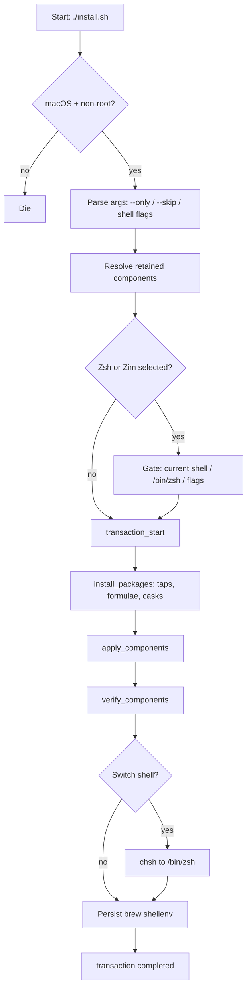
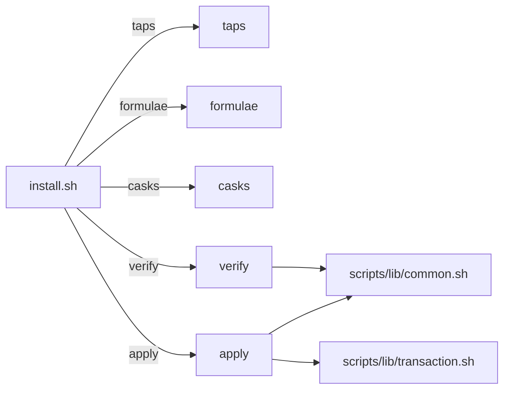
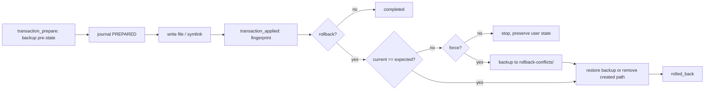
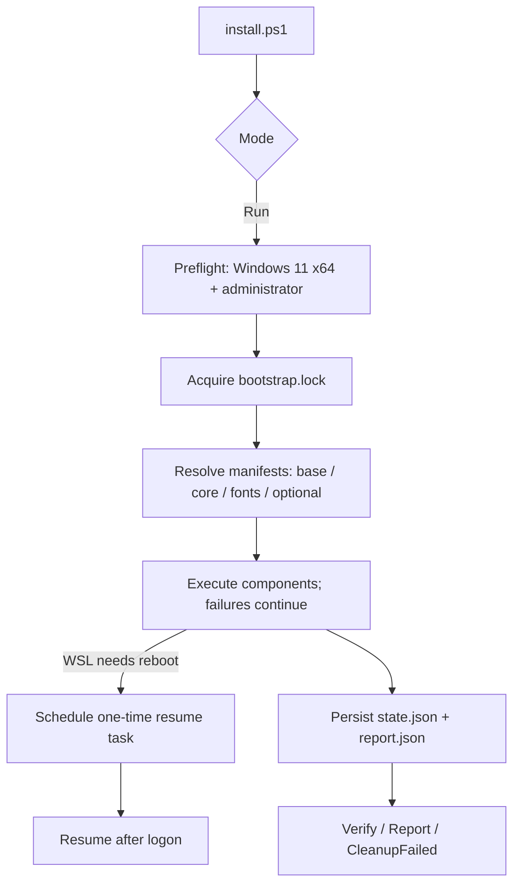

# Architecture

**English** | [简体中文](architecture.zh-CN.md)

This document describes the installer pipeline, component model, transaction system, Zsh policy, and repository scope.

## Installer pipeline

`install.sh` (with shared libraries under `scripts/lib/`) drives the whole run.



Steps (mirrors [README lifecycle](../README.md)):

1. Reject non-macOS and root execution.
2. Resolve `--only` / `--skip` into retained components and gate Zsh components.
3. Start a file transaction that journals every installer-owned mutation.
4. Collect and deduplicate Homebrew taps, formulae, and casks.
5. Install missing Homebrew packages.
6. Apply selected component configuration; each file and symlink change is recorded in the running transaction.
7. Verify each selected component.
8. Persist Homebrew shell environment for non-empty component runs, then mark the transaction complete.

`--dry-run` is intentionally unsupported. Use `tests/integration.sh`.

## Component model

Components live in `scripts/components/<name>.sh` and expose subcommands consumed by `install.sh`.



Shared libraries:

- `scripts/lib/common.sh` — logging (`log`/`debug`/`warn`/`die`), command resolution, transaction-aware file/symlink/profile helpers (`ensure_symlink`, `write_managed_file`, `ensure_line_in_file`), shell detection and switching.
- `scripts/lib/brew.sh` — Homebrew discovery, bootstrap, taps, formulae, casks, shellenv activation and persistence.
- `scripts/lib/transaction.sh` — run journal, backups, fingerprints, rollback and conflict handling.

### Component contract

Each component implements a subset of `formulae`, `taps`, `casks`, `apply`, `verify`:

```bash
case "${1:-}" in
  formulae) printf 'tool\n' ;;
  taps) ;;
  casks) ;;
  apply) apply_component ;;
  verify) verify_component ;;
  *) die "Unknown subcommand" ;;
esac
```

Package needs must be declared before `apply`, not installed ad hoc inside components.

## Transaction and rollback

Every run gets a run ID; all mutations are journaled under `${XDG_STATE_HOME:-~/.local/state}/dotfiles-installer`.



- Normal rollback restores replaced paths and removes created paths, newest first.
- If a managed path changed since install, rollback preserves it and stops.
- Forced rollback (`--rollback-force`) saves the conflicting version under that run's `rollback-conflicts/` before restoring.
- Rollback covers only files and symlinks changed through transaction helpers. It does not reverse packages, taps, casks, `chsh`, `/etc/shells`, Zim/TPM downloads, or application state.

## Zsh policy

`/bin/zsh` is required whenever `zsh` or `zim` is selected. The installer uses only macOS-provided `/bin/zsh`; it never installs or selects Homebrew Zsh.

| Situation | Behavior |
| --- | --- |
| Current shell is Zsh | Apply Zsh/Zim configuration normally. |
| Current shell not Zsh, `/bin/zsh` absent | Stop before package install with: `安装器仅允许 macos 系统的终端 zsh shell 情况下运行。` |
| Current shell not Zsh, interactive | Ask to set login shell to `/bin/zsh` via `chsh`. Accept: apply then attempt change. Decline: skip Zsh/Zim, continue others. |
| Noninteractive non-Zsh run | Skip Zsh/Zim; use `--configure-zsh` or `--switch-shell` for deterministic behavior. |
| `--configure-zsh` | Apply Zsh/Zim configuration without `chsh` or prompt. |
| `--switch-shell` | Apply Zsh configuration, then attempt `chsh -s /bin/zsh` after apply/verify. Requires the `zsh` component. |
| `--no-shell-switch` | Suppress prompt and any `chsh` path; non-Zsh runs skip Zsh/Zim unless `--configure-zsh` given. |

The installer never edits `/etc/shells` and never replaces the current shell process. After a successful login-shell change, open a new terminal or run `exec /bin/zsh -l`.

## Scope and ignored paths

Repository configuration is limited to files consumed by retained components or native macOS paths.

- Git and tmux use native XDG paths: `~/.config/git/config`, `~/.config/tmux/tmux.conf`. Legacy `~/.gitconfig` and `~/.tmux.conf` loaders are removed only if they exactly match old installer-generated content; unknown files are preserved with a warning.
- Ignored local state (`.gitignore`): secrets and local overrides (`.env`, `git/config.local`, `zsh/env.local.zsh`), application/editor configs (`opencode/`, `codex/`, `claude/`, `pi/`, `cursor/`, `vscode/`, `fish/`, etc.), runtime/cache/logs (`.zcompdump*`, `*.log`, `*.tmp`, Raycast extensions, `.serena/`, `.backup/`).
- The installer does not claim, configure, or roll back ignored local state.

## Runtime output and diagnostics

Normal output reports the install plan, package/apply/verify stages, warnings, and the transaction run ID.

`--debug` adds non-sensitive diagnostics: resolved component selection, tap/formula/cask plan, component script path, Homebrew path, transaction ID, and package commands issued through the installer wrapper. It does not enable shell tracing, print environment variables or `.env` values, or replace the sandbox integration tests.

## Windows bootstrap pipeline

`windows-bootstrap/install.ps1` is an independent lifecycle, not a subcommand of `install.sh`. It supports Windows PowerShell 5.1 and PowerShell 7 on Windows 11 x64. The unified `bootstrap.sh` forwards Windows Git Bash/MSYS2/Cygwin to this entry (PowerShell 7 when available, Windows PowerShell 5.1 otherwise); macOS still delegates to `install.sh`, and Linux/WSL is rejected. Mutating operations request UAC elevation automatically when the window is not elevated; `-DryRun` and `-Report` never elevate, and `-NoElevate` disables the relaunch.



- State, report, lock, backups, and the resume task are scoped to the current run; `-DryRun` creates none of them and mutates no Registry, profile, WSL, or input-method state.
- Component outcomes are explicit: `completed`, `failed`, `failed_uncleaned`, `recovery_required`, `manual_required`. Exit code `1` reflects failed or recovery-required components; manual-only runs exit `0`.
- Cleanup removes or restores only current-run owned, fingerprint-matching paths; unknown software, AppData, and registry entries are never deleted.
- Each component prints `[i/N] name - status (duration)` and updates a `Write-Progress` bar; long child output streams into `logs/bootstrap.log` and the report records `logPath`. `-Quiet` keeps only the log, and `-NoProgress` keeps text lines without the bar.
- The execution record for this lifecycle is in [the acceptance evidence](handoff-windows-rime-native-acceptance-evidence.md).

## Native Windows acceptance

Windows RIME is separate from the macOS `install.sh` pipeline. Its portable
PowerShell tests cover pure logic and controlled temporary-directory behavior;
they do **not** certify Windows-native behavior. A disposable-guest run has
verified a subset (host contract, Registry/Junction recovery fixtures, isolated
Mint staging, lifecycle failure handling); [the acceptance evidence](handoff-windows-rime-native-acceptance-evidence.md)
records the PASS/BLOCKED/UNVERIFIED split. Release acceptance requires a
Windows 11 x64 machine and all of the following:

1. Run every public RIME command from a signed PowerShell 7 x64 `pwsh.exe`.
   Verify the UAC ACL fallback rejects an earlier hostile `PATH` shadow rather
   than elevating it.
2. Force an initial profile-switch failure with both a pre-existing and absent
   `HKCU\Software\Rime\Weasel\RimeUserDir` property. Verify exact Registry
   restoration and read-back; separately verify a forced restore failure is
   persisted as `recovery_required`.
3. Interrupt each Junction transaction phase, then verify lock-protected
   recovery retains or restores only the expected managed selector.
4. Run matching Weasel servers from one runtime under different SIDs/sessions;
   stop one and prove the other remains running. Verify PID/path/SID/session/
   start-time revalidation before graceful or forced stop.
5. Verify Interactive and Quiet deployment produce fresh required schema/table/
   prism artifacts; exercise deployment failure and selector rollback.
6. Verify Moqi Lite-to-Full and Full-to-Lite behavior, Full-only resources, and
   Cangjie/Stroke/official Luna dependency closure without Weasel shared-data
   reliance.
7. Race a reparse-point swap against managed copy/delete/write/archive/profile/
   export/control operations. Final path checks must fail closed. They do not
   eliminate the residual syscall check-to-use window: handle-relative no-follow
   APIs plus final object identity verification remain a release security
   blocker until separately designed and proven.
8. Execute every Raycast wrapper from its actual configured directory and
   inspect `install-report.json` for successful, manual-required, failed, and
   recovery-required component states.
9. Confirm a root whose marker names another SID is refused before any ACL grant
   or UAC elevation, and that a switch invoked while `windows/install.ps1` runs
   is refused instead of proceeding.
10. Confirm runtime control reports an uninspectable `WeaselServer.exe` as an
    error rather than as "no server running", and verify the
    `MainWindowHandle`-gated graceful stop and the forced-stop fallback against a
    windowless server, plus NTFS `Move-Item` Junction rename semantics.

Do not report any item above as passed from macOS/Linux portable evidence.
