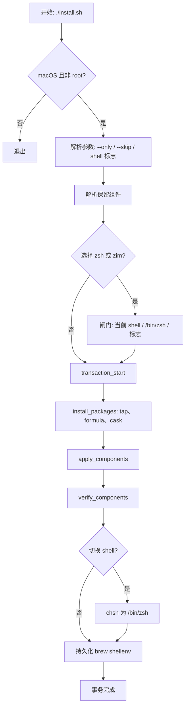
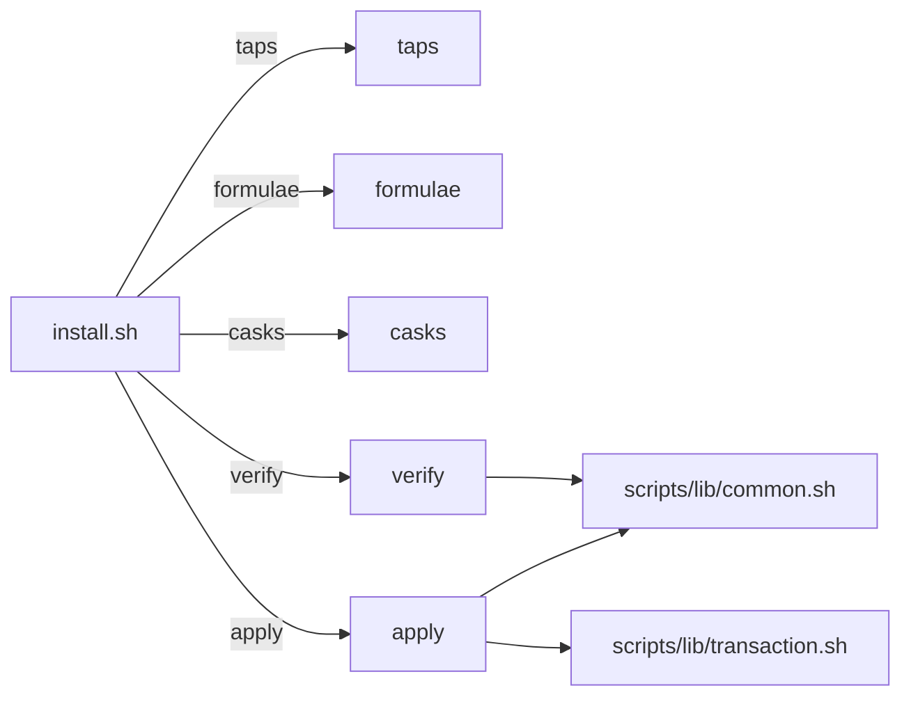
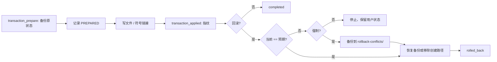
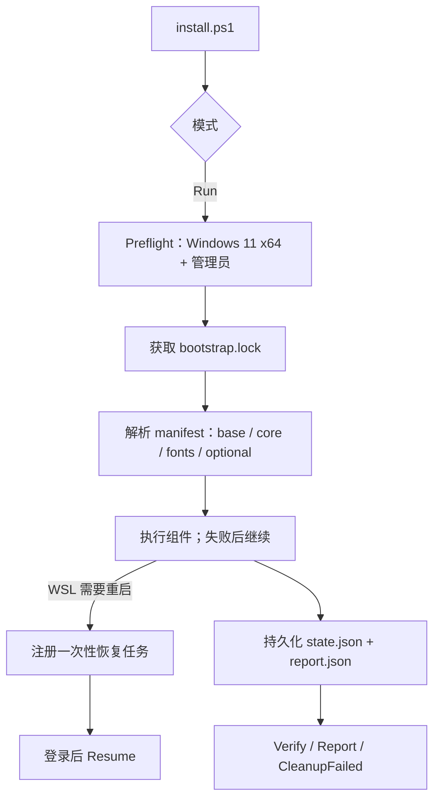

# 架构

[English](architecture.md) | **简体中文**

本文档描述安装流程、组件模型、事务系统、Zsh 策略与仓库范围。

## 平台调度

[`bootstrap.sh`](../bootstrap.sh) 是统一入口，只负责路由：Darwin 委派 `install.sh`，Windows Git Bash/MSYS2/Cygwin 转发到 `windows-bootstrap/install.ps1`，Linux/WSL 返回状态 `2`。平台入口彼此独立——Windows 流程不加载 macOS 代码（反之亦然）——共享内容限于文档与概念命名。平台原生入口保持可直接运行，供 CI 与恢复使用；调度器除路由判断外不包含任何平台业务逻辑。

## 安装流程

`install.sh`（配合 `scripts/lib/` 下的共享库）驱动整个运行过程。



步骤（与 [README 生命周期](../README.zh-CN.md) 对应）：

1. 拒绝非 macOS 与 root 执行。
2. 根据 `--only` / `--skip` 解析保留组件，并闸门检查 Zsh 组件。
3. 启动文件事务，记录每一次安装器自有的变更。
4. 收集并去重 Homebrew tap、formula 与 cask。
5. 安装缺失的 Homebrew 软件包。
6. 应用所选组件配置；每次文件与符号链接变更都会记入进行中的事务。
7. 验证每个所选组件。
8. 对非空组件运行持久化 Homebrew shell 环境，然后标记事务完成。

`--dry-run` 故意不支持。请使用 `tests/integration.sh`。

## 组件模型

组件位于 `scripts/components/<name>.sh`，向 `install.sh` 暴露子命令。



共享库：

- `scripts/lib/common.sh` — 日志（`log`/`debug`/`warn`/`die`）、命令解析、事务感知的文件/符号链接/配置文件辅助函数（`ensure_symlink`、`write_managed_file`、`ensure_line_in_file`）、shell 检测与切换。
- `scripts/lib/brew.sh` — Homebrew 发现、bootstrap、tap、formula、cask、shellenv 激活与持久化。
- `scripts/lib/transaction.sh` — 运行日志、备份、指纹、回滚与冲突处理。

### 组件契约

每个组件实现 `formulae`、`taps`、`casks`、`apply`、`verify` 的子集：

```bash
case "${1:-}" in
  formulae) printf 'tool\n' ;;
  taps) ;;
  casks) ;;
  apply) apply_component ;;
  verify) verify_component ;;
  *) die "Unknown subcommand" ;;
esac
```

软件包需求必须在 `apply` 之前声明，不可在组件内临时安装。

## 事务与回滚

每次运行都有 run ID；所有变更记录在 `${XDG_STATE_HOME:-~/.local/state}/dotfiles-installer` 下。



- 普通回滚恢复被替换的路径、移除创建的路径，新的优先。
- 若受管路径在安装后被修改，回滚会保留它并停止。
- 强制回滚（`--rollback-force`）会先把冲突版本保存到该次运行的 `rollback-conflicts/`，再恢复。
- 回滚只覆盖通过事务辅助函数变更的文件与符号链接。不撤销软件包、tap、cask、`chsh`、`/etc/shells`、Zim/TPM 下载或应用状态。

## Zsh 策略

选择 `zsh` 或 `zim` 时，必须存在 `/bin/zsh`。安装器仅使用 macOS 自带的 `/bin/zsh`，绝不安装或选择 Homebrew Zsh。

| 情况 | 行为 |
| --- | --- |
| 当前 Shell 为 Zsh | 正常应用所选 Zsh/Zim 配置。 |
| 当前 Shell 非 Zsh，且 `/bin/zsh` 不存在 | 在软件包安装前停止，并输出：`安装器仅允许 macos 系统的终端 zsh shell 情况下运行。` |
| 当前 Shell 非 Zsh，且终端可交互 | 询问是否通过 `chsh` 将登录 Shell 设为 `/bin/zsh`。接受：应用后尝试更改。拒绝：跳过 Zsh/Zim，继续其他组件。 |
| 非交互式的非 Zsh 运行 | 跳过 Zsh/Zim；使用 `--configure-zsh` 或 `--switch-shell` 获得确定行为。 |
| `--configure-zsh` | 应用 Zsh/Zim 配置，不运行 `chsh`，不询问。 |
| `--switch-shell` | 应用 Zsh 配置，在 apply/verify 后尝试 `chsh -s /bin/zsh`。要求选中 `zsh` 组件。 |
| `--no-shell-switch` | 禁止询问和任何 `chsh` 路径；非 Zsh 运行会跳过 Zsh/Zim，除非给出 `--configure-zsh`。 |

安装器绝不修改 `/etc/shells`，也绝不替换当前 Shell 进程。成功更改登录 Shell 后，请新开终端或手动运行 `exec /bin/zsh -l`。

## 范围与忽略路径

仓库配置仅限于保留组件消费的文件或 macOS 原生路径。

- Git 与 tmux 使用原生 XDG 路径：`~/.config/git/config`、`~/.config/tmux/tmux.conf`。旧 `~/.gitconfig` 和 `~/.tmux.conf` loader 仅在内容完全匹配旧安装器模板时移除；未知文件会保留并发出警告。
- 忽略的本地状态（`.gitignore`）：密钥与本地覆盖（`.env`、`git/config.local`、`zsh/env.local.zsh`）、应用/编辑器配置（`opencode/`、`codex/`、`claude/`、`pi/`、`cursor/`、`vscode/`、`fish/` 等）、运行时/缓存/日志（`.zcompdump*`、`*.log`、`*.tmp`、Raycast extensions、`.serena/`、`.backup/`）。
- 安装器不声明、不配置、不回滚被忽略的本地状态。

## 运行输出与诊断

常规输出报告安装计划、软件包/apply/verify 阶段、警告与事务 run ID。

`--debug` 增加非敏感诊断：解析后的组件选择、tap/formula/cask 计划、组件脚本路径、Homebrew 路径、事务 ID，以及通过安装器 wrapper 执行的软件包命令。它不会启用 shell tracing、打印环境变量或 `.env` 值，也不会替代沙箱集成测试。

## Windows bootstrap 流程

`windows-bootstrap/install.ps1` 是独立生命周期，不是 `install.sh` 的子命令。支持 Windows 11 x64 上的 Windows PowerShell 5.1 与 PowerShell 7。统一入口 `bootstrap.sh` 在 Windows Git Bash/MSYS2/Cygwin 下转发到这里（优先 PowerShell 7，缺失时用 Windows PowerShell 5.1）；macOS 仍委派 `install.sh`，Linux/WSL 被拒绝。需要管理员的操作在非提权窗口会自动申请 UAC；`-DryRun` 与 `-Report` 不提权，`-NoElevate` 可关闭自动重启。



- 状态、报告、锁、备份与恢复任务都限定于本次运行；`-DryRun` 不创建这些文件，也不修改 Registry、profile、WSL 或输入法状态。
- 组件结果是显式的：`completed`、`failed`、`failed_uncleaned`、`recovery_required`、`manual_required`。退出码 `1` 表示存在 failed 或 recovery_required；纯人工项运行退出 `0`。
- Cleanup 只删除或恢复本次运行拥有且指纹匹配的路径；绝不删除未知软件、AppData 或注册表项。
- 每个组件打印 `[i/N] 名称 - 状态 (耗时)` 并更新 `Write-Progress` 进度条；长任务子进程输出实时写入 `logs/bootstrap.log`，报告记录 `logPath`。`-Quiet` 只保留日志，`-NoProgress` 保留文本行但不要进度条。
- 该生命周期的执行记录见 [验收证据](handoff-windows-rime-native-acceptance-evidence.md)。

## Windows 原生验收

Windows RIME 不属于 macOS `install.sh` 流程。其便携 PowerShell 测试只覆盖纯逻辑与受控临时目录行为，**不能**认证 Windows 原生行为。disposable guest 运行已验证其中一个子集（host 契约、Registry/Junction 恢复 fixture、隔离 Mint staging、生命周期失败处理）；PASS/BLOCKED/UNVERIFIED 分层见[验收证据](handoff-windows-rime-native-acceptance-evidence.md)。发布前必须在 Windows 11 x64 上完成：

1. 所有 public RIME 命令从签名有效的 PowerShell 7 x64 `pwsh.exe` 运行；验证先于真实 host 的 hostile `PATH` shadow 不会被 ACL UAC fallback 提升。
2. 在 `HKCU\Software\Rime\Weasel\RimeUserDir` 原本存在、原本不存在两种状态下强制 profile switch 失败，验证精确 Registry restore 与 read-back；再验证强制 restore 失败写入 `recovery_required`。
3. 在每个 Junction transaction phase 中断，验证 lock 保护的 recovery 只保留或恢复预期受管 selector。
4. 让同一 runtime 的 Weasel server 运行于不同 SID/session；停止一个并证明另一个仍运行。验证 graceful/force stop 前 PID/path/SID/session/start-time 都重新核对。
5. 验证 Interactive 和 Quiet deploy 均生成新鲜 schema/table/prism artifact，并覆盖 deploy failure 与 selector rollback。
6. 验证 Moqi Lite→Full、Full→Lite、Full-only resource、Cangjie/Stroke/官方 Luna 依赖闭包，不依赖 Weasel shared data。
7. 将 reparse-point swap 与 managed copy/delete/write/archive/profile/export/control 操作竞争；最终路径检查必须 fail closed。它不消除最后 syscall check-to-use 窗口：handle-relative no-follow API 与最终对象 identity verification 仍是独立设计/证明前的发布安全 blocker。
8. 从真实 Raycast script directory 执行所有 wrapper，并检查 `install-report.json` 的 completed、manual_required、failed、recovery_required component state。
9. 验证 marker 指向其他 SID 的 root 在任何 ACL grant 或 UAC elevation 之前被拒绝；验证 `windows/install.ps1` 运行期间发起的 switch 被拒绝而非继续。
10. 验证无法检查的 `WeaselServer.exe` 被报告为错误而不是「没有 server 在运行」；验证 `MainWindowHandle` 门控的 graceful stop 与强制停止回退在无窗口 server 上的行为，以及 NTFS `Move-Item` 重命名 Junction 的语义。

不得把 macOS/Linux 便携证据表述为以上任一项已通过。
